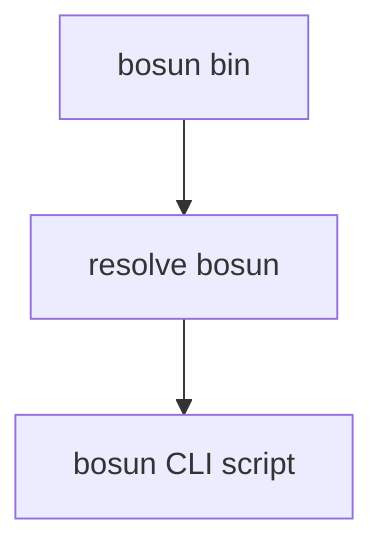

# Bosun Shim — AGENTS Guide

## Module Overview
- Purpose: Provide a legacy npm shim that forwards `bosun` CLI commands to `bosun`.
- Use when: Updating the deprecation redirect behavior or adding legacy command aliases.
- Key entry points: `scripts/bosun/cli.mjs:1`, `scripts/bosun/package.json:1`.

## Architecture
- Single entrypoint script resolves the installed `bosun` package
  and launches the appropriate bosun CLI script based on the invoked command.
- Directory layout:
  - `bin/` shim launcher(s)
  - `package.json` npm metadata and bin mappings
  - `README.md` deprecation notice and install guidance



## Core Concepts
- Legacy compatibility: keep the old command names working while funneling users
  to the new `bosun` binaries.
- Forwarding: the shim delegates execution to bosun and preserves CLI args.

## Usage Examples

### Install the legacy shim
```bash
npm install -g bosun
```

### Run the shim (forwards to bosun)
```bash
bosun --help
```

## Implementation Patterns
- Add new legacy aliases by updating `bin` entries in
  `scripts/bosun/package.json:1` and mapping in
  `scripts/bosun/cli.mjs:1`.
- Keep the shim minimal and avoid embedding bosun logic here.
- Anti-patterns:
  - Duplicating bosun implementation in the shim.
  - Removing legacy aliases without a documented migration path.

## Configuration
- No runtime configuration beyond standard Node.js environment.

## Testing
- No automated tests for the shim.
- Manual smoke check (requires published or local bosun install):
  - `node scripts/bosun/cli.mjs --help`

## Troubleshooting
- Shim cannot find bosun:
  - Cause: `bosun` dependency not installed.
  - Fix: `npm install -g bosun` or reinstall `bosun`.
