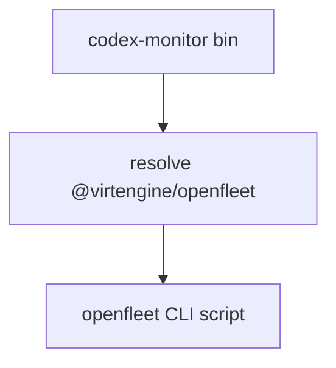

# Codex Monitor Shim — AGENTS Guide

## Module Overview
- Purpose: Provide a legacy npm shim that forwards `codex-monitor` CLI commands to `@virtengine/openfleet`.
- Use when: Updating the deprecation redirect behavior or adding legacy command aliases.
- Key entry points: `scripts/codex-monitor/bin/codex-monitor.mjs:1`, `scripts/codex-monitor/package.json:1`.

## Architecture
- Single entrypoint script resolves the installed `@virtengine/openfleet` package
  and launches the appropriate openfleet CLI script based on the invoked command.
- Directory layout:
  - `bin/` shim launcher(s)
  - `package.json` npm metadata and bin mappings
  - `README.md` deprecation notice and install guidance



## Core Concepts
- Legacy compatibility: keep the old command names working while funneling users
  to the new `openfleet` binaries.
- Forwarding: the shim delegates execution to openfleet and preserves CLI args.

## Usage Examples

### Install the legacy shim
```bash
npm install -g codex-monitor
```

### Run the shim (forwards to openfleet)
```bash
codex-monitor --help
```

## Implementation Patterns
- Add new legacy aliases by updating `bin` entries in
  `scripts/codex-monitor/package.json:1` and mapping in
  `scripts/codex-monitor/bin/codex-monitor.mjs:1`.
- Keep the shim minimal and avoid embedding openfleet logic here.
- Anti-patterns:
  - Duplicating openfleet implementation in the shim.
  - Removing legacy aliases without a documented migration path.

## Configuration
- No runtime configuration beyond standard Node.js environment.

## Testing
- No automated tests for the shim.
- Manual smoke check (requires published or local openfleet install):
  - `node scripts/codex-monitor/bin/codex-monitor.mjs --help`

## Troubleshooting
- Shim cannot find openfleet:
  - Cause: `@virtengine/openfleet` dependency not installed.
  - Fix: `npm install -g @virtengine/openfleet` or reinstall `codex-monitor`.
